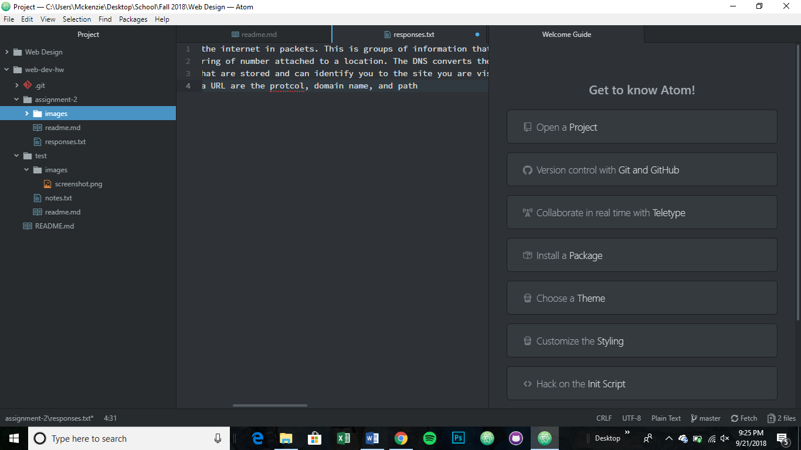

## Readme Assignment 2
A version control system saves all of the changes you make before publishing them to the actual website. This allows you to be able to go back to the exact place where mistakes happen and revert to that edit. This is useful in our class to make sure we can see where problems arise and be able to revert to the exact spot quickly

My [responses](./responses.txt)

This cycle the thing that I struggled most with was getting my links correct. The responses link was fairly easy but I struggled to get the deeper level link of the screenshot in. Ultimately I refered to the deeper level linking tutorial on the website and was able to see where I was going wrong. 

