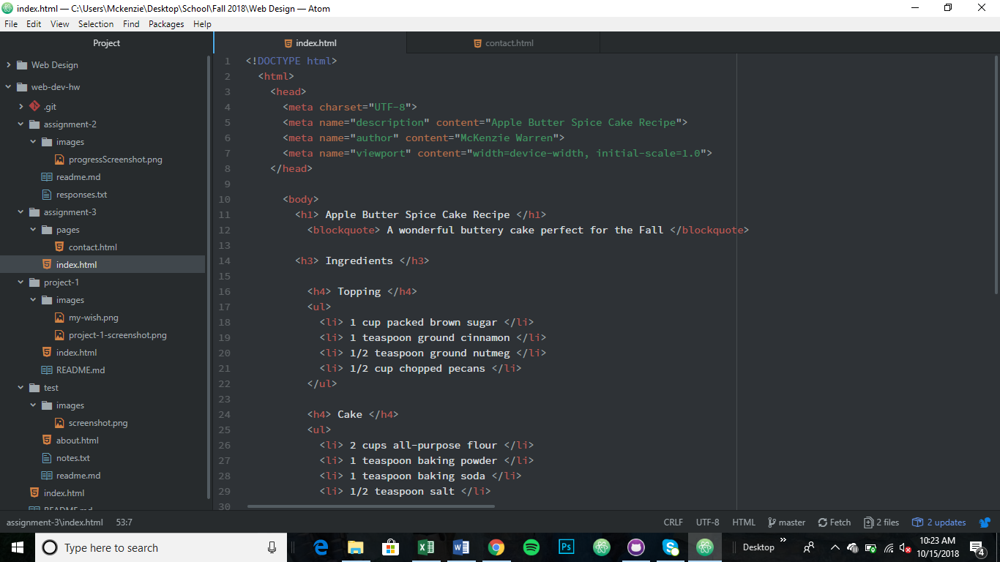

# Assignment 3 Readme

There is just 1 head and body element in each html document

Structural markup gives information about the structure of the document. This includes headings, paragraphs and lists.
Semantic markup reinforce the meaning of the information. This includes things like bolding, italics, and addresses.

This work cycle was pretty fun for me. I really enjoyed learning more and feeling like I was starting to understand the basics of html. I chose to use a recipe that I make regularly in the Fall, so it was fun to add a personal touch. I really got better this week at linking. I did not have any issues with it, so that was a triumph for me.

 
