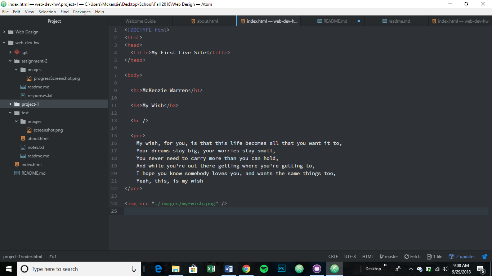

# Project 1 Readme

The browser that I use the most is Google Chrome on both my computer and my phone.
A browser functions by having the code input and translating it into preformatted
text and images that the user sees as a web page.

On the Wayback Machine I visted yahoo.com from the year 1997. The biggest difference
is that the text is very plain and everyting is a link. There is no content on the
main page and the logo is very dated.

This work cycle was very enjoyable for me. I liked learning html. I think that it
is very straightforward to use. I also was able to get all of my links correct on
the first try as well. Overall I did not have any issues with the work this week.

