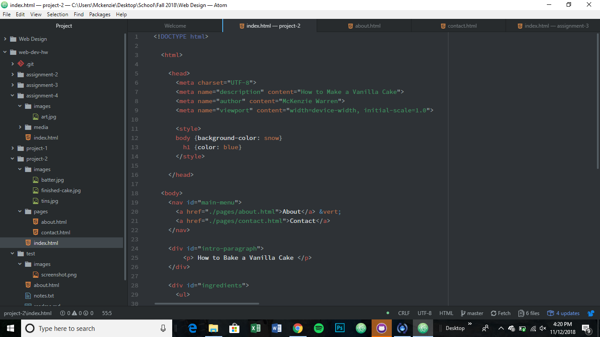

# Project 2 Readme

My experience learning HTML was mildly challening. This was my first time writing code, but I feel like I have a pretty good grasp on what I am doing at this point.

I am very excited to start working in CSS. Mostly I am excited for my pages to not look like they were created in the '90s

This work cycle was pretty easy for me. I enjoyed putting together what I have learned in HTML.

